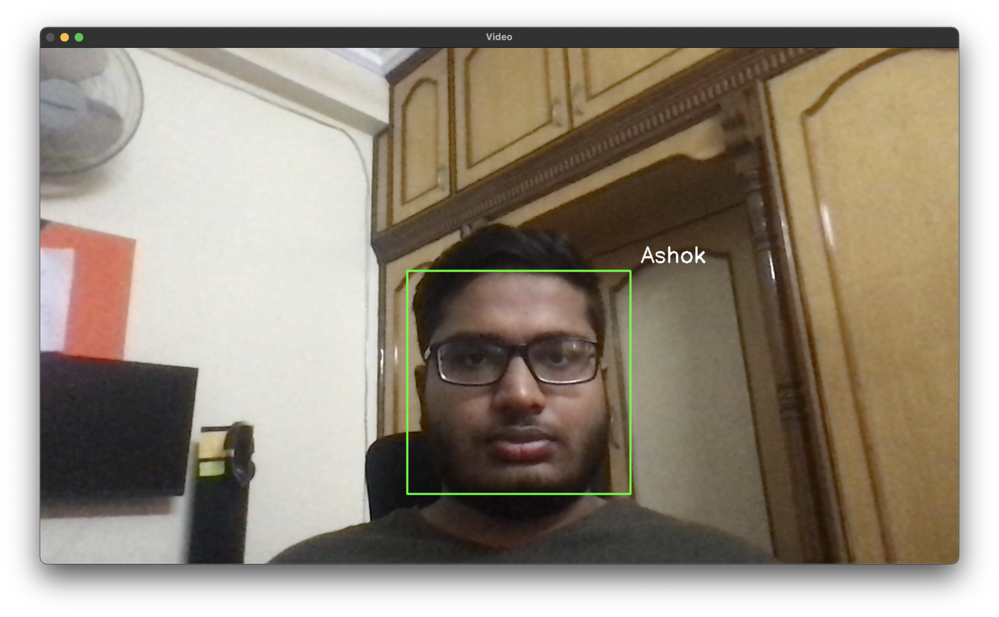

# facial_recog

face detect


face recog

Tested on OSX BIG SUR & Ubuntu 20.04 LTS.

The user has to make minor changes for the code to work on their system.

Used transfer learning.
link for weights : https://drive.google.com/file/d/1kBrUQPDvLvC15Vpb4akxffK0NckRBcxO/view?usp=sharing

install the requiremnts by ``` pip3 install -r requirements.txt```

first run ``` python3 createData.py``` to click 100 pictures of yourself, bearing in mind to input your name at line 18 ```user = ""```

then run ``` python3 main.py ``` to get real-time facial recognition.

If your video feed is laggy, please import the threadStream function from utils, like this ``` from uitls import threadedStream ```, 
and use it like this ``` stream = threadStream(src=0).start() ```

This is the new version of an old repo(deleted). 
